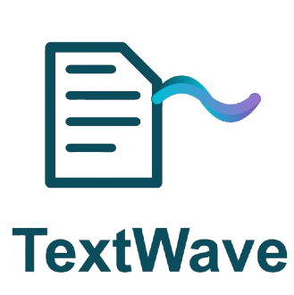

# TextWave



**Convert PDFs to MP3 Audio**

[](https://github.com/kc9wwh/TextWave/releases/latest)
[](https://github.com/kc9wwh/TextWave/blob/main/LICENSE)
[](https://www.python.org/)

---

## 📖 About

TextWave is a user-friendly macOS application that converts PDF documents into high-quality MP3 audio files using Microsoft Azure's Neural Text-to-Speech technology. Perfect for listening to documents on the go, accessibility needs, or simply giving your eyes a rest.

*Dedicated to my amazing wife, Merry Christmas! 🎅🏻*

---

## ✨ Features

* **📄 PDF to MP3 Conversion** - Transform any PDF document into natural-sounding audio
* **🎯 Drag & Drop Interface** - Simply drag your PDF into the app or use the file picker
* **🗣️ High-Quality Voice** - Powered by Microsoft Azure Neural TTS (Ava Multilingual)
* **📊 Real-Time Progress** - Live progress tracking with file size estimates
* **🎨 Beautiful GUI** - Modern, intuitive interface built with PyQt6
* **🔄 Auto-Updates** - Built-in update checker for both app and dependencies
* **🧹 Smart Text Extraction** - Automatically removes page numbers and cleans formatting
* **⏸️ Power Management** - Prevents macOS sleep during conversion
* **🎧 Quality Output** - Generates high-fidelity MP3 files ready for any device

---

## 🚀 Quick Start

### For Users

**Download the latest release:**

1. Visit the [Releases Page](https://github.com/kc9wwh/TextWave/releases/latest)
2. Download `TextWave.dmg` or `TextWave.app.zip`
3. Open the downloaded file and drag TextWave to your Applications folder
4. Launch TextWave and start converting!

The app auto-installs runtime dependencies (PyQt6, edge-tts, pypdf) on first run if missing.

### For Developers

**Run from source:**

```bash
# Clone the repository
git clone https://github.com/kc9wwh/TextWave.git
cd TextWave

# Install dependencies
pip install -r requirements-test.txt

# Run the application
python pdf2mp3_gui.py
```

---

## 📱 Usage

1. **Launch TextWave**
2. **Select your PDF:**
   - Drag and drop a PDF file onto the window, or
   - Click "Select PDF" to browse for a file
3. **Convert:**
   - Click "Convert to MP3"
   - Choose where to save the output
4. **Done!** Your PDF is now an MP3 audio file

---

## 🛠️ Building from Source

### Prerequisites

* macOS 11.5 or later
* Python 3.8+
* py2app (for building the .app bundle)

### Build the .app Bundle

```bash
# Install build dependencies
pip install py2app PyQt6 pypdf edge-tts

# Build the application
python setup.py py2app

# The app will be created in dist/TextWave.app
```

Detailed build instructions available in [BUILD_APP.md](BUILD_APP.md)

---

## 🧪 Testing

Run the test suite:

```bash
# Install test dependencies
pip install -r requirements-test.txt

# Run tests
pytest
```

For comprehensive testing documentation, see [TESTING.md](TESTING.md)

---

## 🔄 Automated Releases

TextWave uses GitHub Actions for CI/CD:

* **PR Testing** - Automatic test runs on pull requests
* **Release Build** - Automated builds when version tags are pushed
* **Version Management** - Update version in `pdf2mp3_gui.py`, commit, and tag

```bash
# Create a new release
git tag v0.5.3
git push origin v0.5.3
```

GitHub Actions will automatically build and attach the .app bundle to the release.

---

## 🏗️ Architecture

* **GUI Framework:** PyQt6
* **PDF Processing:** pypdf
* **Text-to-Speech:** Microsoft Edge TTS (edge-tts)
* **Voice:** Azure Neural - Ava Multilingual (en-US)
* **Audio Format:** MP3

---

## 📋 Requirements

### Runtime
* macOS 11.15 or later
* Internet connection (for TTS service)

### Dependencies (auto-installed)
* PyQt6 >= 6.0.0
* pypdf >= 3.0.0
* edge-tts >= 6.0.0

---

## 🤝 Contributing

Contributions are welcome! Here's how you can help:

1. Fork the repository
2. Create a feature branch (`git checkout -b feature/amazing-feature`)
3. Commit your changes (`git commit -m 'Add amazing feature'`)
4. Push to the branch (`git push origin feature/amazing-feature`)
5. Open a Pull Request

Please ensure:
- Tests pass (`pytest`)
- Code follows existing style
- Update unit tests for new or modified features
- Commit messages are descriptive

---

## 📝 License

This project is licensed under the MIT License - see the [LICENSE](LICENSE) file for details.

---

## 🙏 Acknowledgments

* Built with [PyQt6](https://www.riverbankcomputing.com/software/pyqt/)
* TTS powered by [edge-tts](https://github.com/rany2/edge-tts)
* PDF processing by [pypdf](https://github.com/py-pdf/pypdf)
* Microsoft Azure Neural Voices

---

## 💬 Support

* **Issues:** [GitHub Issues](https://github.com/kc9wwh/TextWave/issues)

---

## 🗺️ Roadmap

- [ ] App signing and notarization
- [ ] Custom regex support for text removal (i.e., Page 21)
- [ ] Support for additional TTS voices
- [ ] Support for other TTS providers
- [ ] Windows and Linux support

---

**Made with ❤️ for my wife**
